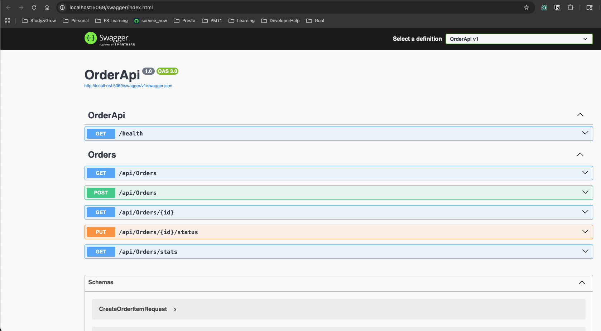
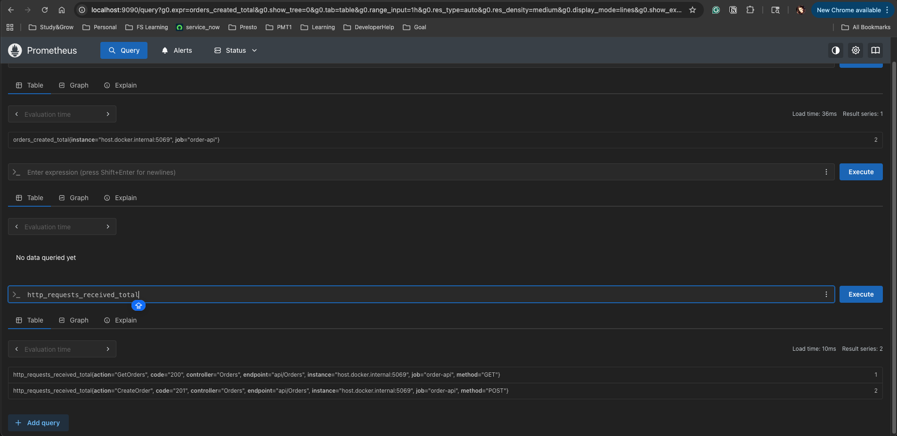
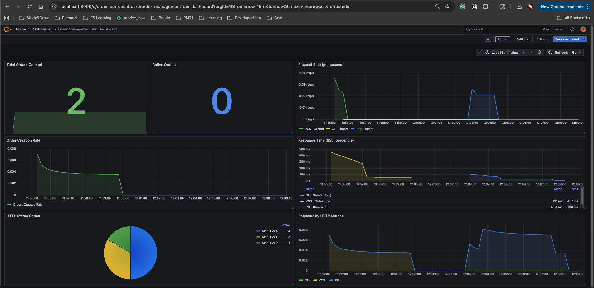

[paste the content from the artifact above]
# Order Management System

A full-stack order management API built with .NET Core, demonstrating modern cloud-native development practices with comprehensive monitoring and observability.

## 🚀 Features

- **RESTful API** - Complete CRUD operations for order management
- **Database Integration** - PostgreSQL with Entity Framework Core
- **Monitoring & Metrics** - Prometheus metrics with Grafana dashboards
- **API Documentation** - Interactive Swagger/OpenAPI documentation
- **Health Checks** - Built-in health monitoring endpoints
- **Docker Support** - Containerized database and monitoring stack

## 🛠️ Tech Stack

- **Backend**: ASP.NET Core 8, C#
- **Database**: PostgreSQL 16
- **ORM**: Entity Framework Core
- **Metrics**: Prometheus (prometheus-net)
- **Visualization**: Grafana
- **API Documentation**: Swagger/OpenAPI
- **Containerization**: Docker & Docker Compose

## 📋 Prerequisites

- [.NET 8 SDK](https://dotnet.microsoft.com/download)
- [Docker Desktop](https://www.docker.com/products/docker-desktop)
- Git

## 🏃 Getting Started

### 1. Clone the repository

```bash
git clone https://github.com/yourusername/OrderManagementSystem.git
cd OrderManagementSystem
```

### 2. Start the infrastructure (Database, Prometheus, Grafana)

```bash
docker compose up -d
```

Wait about 10-15 seconds for services to start.

### 3. Run database migrations

```bash
cd src/OrderApi
dotnet ef database update --project ../OrderApi.Data/OrderApi.Data.csproj
```

### 4. Run the API

```bash
dotnet run
```

The API will start on `https://localhost:5XXX` (port will be shown in console)

## 📡 Endpoints

### API Documentation
- **Swagger UI**: `http://localhost:5XXX/swagger`


### Core Endpoints
- `GET /api/orders` - List all orders (with pagination)
- `GET /api/orders/{id}` - Get specific order
- `POST /api/orders` - Create new order
- `PUT /api/orders/{id}/status` - Update order status
- `GET /api/orders/stats` - Get order statistics

@

### Monitoring
- `GET /health` - Health check endpoint
- `GET /metrics` - Prometheus metrics

## 🔍 Monitoring Stack

### Prometheus
Access at `http://localhost:9090`

Custom metrics available:
- `orders_created_total` - Total orders created
- `orders_active_total` - Current active orders
- `http_requests_received_total` - HTTP request metrics
- `http_request_duration_seconds` - Response time metrics
 
### Metrics (Prometheus)


### Grafana
Access at `http://localhost:3000`
- **Login**: admin / admin
- **Dashboard**: "Order Management API Dashboard"

### Monitoring Dashboard (Grafana)



The dashboard includes:
- Total orders created
- Active orders count
- Request rate per second
- Response time (95th percentile)
- HTTP status code distribution
- Requests by HTTP method

## 📊 Project Structure

```
OrderManagementSystem/
├── src/
│   ├── OrderApi/              # Web API project
│   │   ├── Controllers/       # API controllers
│   │   ├── Program.cs         # Application entry point
│   │   └── appsettings.json   # Configuration
│   ├── OrderApi.Core/         # Domain models
│   │   └── Entities/          # Order, OrderItem entities
│   └── OrderApi.Data/         # Data access layer
│       ├── OrderDbContext.cs  # EF Core context
│       └── Migrations/        # Database migrations
├── infrastructure/
│   ├── prometheus.yml         # Prometheus configuration
│   └── grafana/              # Grafana provisioning
│       ├── datasources/      # Prometheus datasource
│       └── dashboards/       # Pre-built dashboards
├── docker-compose.yml        # Docker services configuration
└── README.md
```

## 🧪 Example Usage

### Create an Order

```bash
curl -X POST http://localhost:5XXX/api/orders \
  -H "Content-Type: application/json" \
  -d '{
    "customerId": "CUST001",
    "items": [
      {
        "productName": "Laptop",
        "quantity": 1,
        "price": 999.99
      },
      {
        "productName": "Mouse",
        "quantity": 2,
        "price": 29.99
      }
    ]
  }'
```

### Get All Orders

```bash
curl http://localhost:5XXX/api/orders?page=1&pageSize=10
```

### Update Order Status

```bash
curl -X PUT http://localhost:5XXX/api/orders/1/status \
  -H "Content-Type: application/json" \
  -d '{"status": 2}'
```

Status values:
- 0: Pending
- 1: Processing
- 2: Shipped
- 3: Delivered
- 4: Cancelled

## 🔧 Configuration

### Connection String
Update `src/OrderApi/appsettings.json` to modify database connection:

```json
{
  "ConnectionStrings": {
    "DefaultConnection": "Host=localhost;Port=5432;Database=OrderManagementDb;Username=orderuser;Password=YourStrong@Passw0rd"
  }
}
```

### Prometheus Scraping
Update `infrastructure/prometheus.yml` to change scrape targets or intervals.

## 📈 Adding Custom Metrics

Example of adding a new metric in `OrdersController.cs`:

```csharp
private static readonly Counter CustomMetric = Metrics
    .CreateCounter("custom_metric_name", "Description of metric");

// Increment the counter
CustomMetric.Inc();
```

## 🧹 Cleanup

Stop and remove all containers:

```bash
docker compose down -v
```

## 🚀 Future Enhancements

- [ ] JWT Authentication & Authorization
- [ ] Rate Limiting
- [ ] Redis Caching
- [ ] Azure Deployment (App Service + Azure SQL)
- [ ] CI/CD Pipeline (GitHub Actions)
- [ ] Integration Tests
- [ ] API Versioning
- [ ] Event-driven architecture with message queues

## 📝 License

This project is licensed under the MIT License.

## 👤 Author

**Your Name**
- GitHub: [@BinakaJP](https://github.com/BinakaJP)
- LinkedIn: [Binaka Paghadal](https://linkedin.com/in/binaka-paghadal/)

## 🙏 Acknowledgments

- Built as a portfolio project to demonstrate full-stack .NET development
- Inspired by modern microservices architecture patterns
- Thanks to the open-source community for the amazing tools